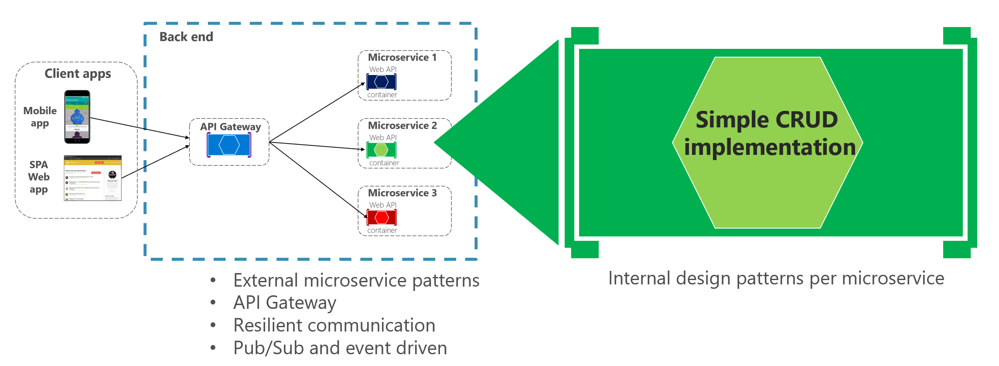

Ejemplo .NET Core 3 REST API.
==============================================================

## Description
Ejemplo .NET Core 3 REST API [Microservicio](https://docs.microsoft.com/es-es/dotnet/architecture/microservices/multi-container-microservice-net-applications/microservice-application-design)

## Architecture [Clean Architecture](http://blog.cleancoder.com/uncle-bob/2012/08/13/the-clean-architecture.html)

## API

### Swagger
* Swashbuckle.AspNetCore.Swagger
* Swashbuckle.AspNetCore.Gen
* Swashbuckle.AspNetCore.SwaggerUI

### Model

Read/Write Model using:
* [Entity Framework Core](https://github.com/dotnet/efcore)
* [Pattern Repository](https://docs.microsoft.com/es-es/aspnet/mvc/overview/older-versions/getting-started-with-ef-5-using-mvc-4/implementing-the-repository-and-unit-of-work-patterns-in-an-asp-net-mvc-application)
* [Pattern Specification](https://enterprisecraftsmanship.com/posts/specification-pattern-c-implementation/)

Mapear Dto - Entity:
* [Automap](https://automapper.org/)

Migracion:
* [Entity Framework Core](https://docs.microsoft.com/es-es/ef/core/managing-schemas/migrations/?tabs=dotnet-core-cli)

## Test

### Test unitarios
* Xunit
* Moq

### Test Funcionales e Integracion
* Microsoft.AspNetCore.Mvc.Testing
* Microsoft.AspNetCore.TestHost
* Xunit

## Related blog articles

* [Diseñar y desarrollar aplicaciones .NET basadas en varios contenedores y microservicios](https://docs.microsoft.com/es-es/dotnet/architecture/microservices/multi-container-microservice-net-applications/)

* [Swagger](https://docs.microsoft.com/es-es/aspnet/core/tutorials/web-api-help-pages-using-swagger?tabs=visual-studio&view=aspnetcore-3.1)

* [Entity Framework Core Doc Microsoft](https://docs.microsoft.com/es-es/ef/core/)

* [Entity Framework Core Tutorial](https://www.entityframeworktutorial.net/)

* [Simple CQRS implementation with raw SQL and DDD and CRUD Basic](http://www.kamilgrzybek.com/design/simple-cqrs-implementation-with-raw-sql-and-ddd/)

## How to run
1. Configure BD
2. Set connection string (in appsettings.json or by user secrets mechanism).
3. Run!
